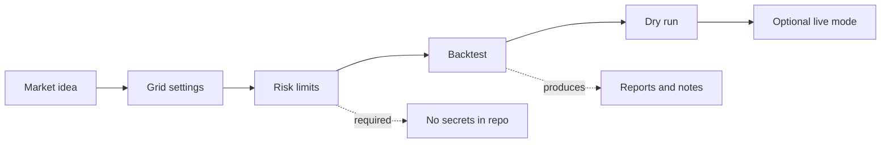

# AFree GridBot

  

  
  
  

AFree GridBot is a lightweight workspace for designing, documenting, and testing grid-trading ideas before they ever touch a live account.

The useful part is not "press button, make money". The useful part is discipline: define strategy rules, record risk limits, test assumptions, and keep credentials outside the codebase.

## What it can help with

- Plan grid-trading strategies in a clear, repeatable format.
- Separate strategy ideas from exchange credentials and live execution.
- Prepare a backtesting loop before any real market interaction.
- Track risk rules such as position size, stop conditions, and max exposure.
- Build a small foundation for future automation without rushing into live trading.

## How the project should grow

## Practical workflow

1. Define the market and timeframe.
2. Choose grid spacing, order count, and capital limits.
3. Run a backtest with historical or sample data.
4. Review drawdown, fees, missed fills, and worst-case exposure.
5. Only then consider a dry-run mode with fake or sandbox credentials.

## Safety rules

- Do not commit API keys, seed phrases, private keys, exchange tokens, or account exports.
- Do not run against a live account until the backtest and dry-run path are documented.
- Treat every strategy result as research, not financial advice.
- Keep generated reports and large datasets out of Git unless they are intentional sample fixtures.

## Suggested next files

- `config.example.env` for placeholder-only configuration names.
- `docs/strategy-template.md` for writing down a grid strategy before coding it.
- `docs/backtest-plan.md` for expected inputs, outputs, and acceptance checks.

## Current status

This repository is currently a planning workspace. The next useful change is to add a minimal strategy template and a no-secrets configuration example.
