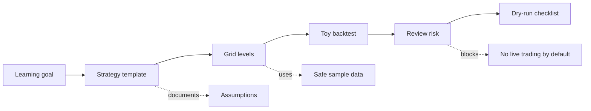

<div align="center">


<p>
  
  
  
</p>

<strong>A free educational grid-bot workspace for learning strategy design, backtesting, and risk discipline.</strong>

</div>

---

## Purpose

Free Educational Grid Bot is a learning project. Its goal is to help beginners understand how grid-trading systems are planned, tested, and reviewed before any real exchange account is involved.

This repository is intentionally education-first: it contains templates, safe example configuration, and simple Python helpers for grid levels and toy backtests. It is not financial advice and it is not a production trading system.

<table>
  <tr>
    <td width="33%">
      <h3>Learn</h3>
      <p>Understand grid ranges, order spacing, fees, and why risk limits matter.</p>
    </td>
    <td width="33%">
      <h3>Practice</h3>
      <p>Run small local examples with fake prices and placeholder configuration.</p>
    </td>
    <td width="33%">
      <h3>Stay Safe</h3>
      <p>Keep real credentials, wallet data, private keys, and account exports out of Git.</p>
    </td>
  </tr>
</table>

## What you can learn here

- How a grid is split into price levels.
- How fee assumptions can change strategy results.
- Why backtesting should happen before dry-run or live execution.
- How to write strategy assumptions before touching trading code.
- How to keep an educational bot separate from real exchange credentials.

## Project flow



## Quick start

```bash
python -m pip install -e .
python examples/simple_backtest.py
```

You can also run tests after installing development dependencies:

```bash
python -m pip install -e .[dev]
python -m pytest
```

## Useful files and folders

| Path | Purpose |
| --- | --- |
| `src/educational_gridbot/grid.py` | Builds evenly spaced grid levels for educational experiments. |
| `src/educational_gridbot/backtest.py` | Runs a tiny research-only grid crossing score over fake price data. |
| `examples/simple_backtest.py` | Shows how to call the helper code with sample prices. |
| `docs/strategy-template.md` | Template for writing strategy assumptions before coding. |
| `docs/backtest-plan.md` | Checklist for reproducible toy backtests. |
| `config.example.env` | Placeholder-only configuration names without real secrets. |
| `tests/test_grid.py` | Small tests for the educational helper functions. |
| `pyproject.toml` | Python project metadata and test configuration. |

## Example idea

```python
from educational_gridbot import GridConfig, run_simple_grid_backtest

prices = [100, 103, 101, 106, 109, 104, 111]
config = GridConfig(lower_price=95, upper_price=115, grid_count=6)
result = run_simple_grid_backtest(prices, config, order_size=10)

print(result)
```

## Safety rules

> This project is for education and research. It should not be treated as financial advice or a live trading bot.

- Never commit API keys, seed phrases, private keys, exchange tokens, or account exports.
- Use fake prices, sandbox data, or historical sample data while learning.
- Do not connect a live account until the strategy, risk limits, and dry-run behavior are documented.
- Keep generated reports and large datasets out of Git unless they are intentional sample fixtures.

## Roadmap

- Add more beginner-friendly examples.
- Add a dry-run checklist.
- Add sample CSV data for offline learning.
- Add strategy comparison notes for different grid settings.

<div align="center">


</div>
