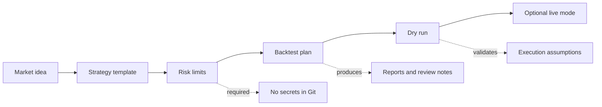

  
  
  

<strong>A clean starting point for planning, testing, and documenting grid-trading ideas before live execution.</strong>

---

## Why this exists

AFree GridBot is not a magic trading button. It is a practical workspace for turning a rough market idea into a documented, testable strategy.

It helps you slow down the risky parts: define the grid, write down risk limits, test assumptions, and keep credentials out of the repository.

<table>
  <tr>
    <td width="33%">
      <h3>Plan</h3>
      
Write the market, timeframe, grid spacing, capital limits, and stop rules before coding.

    </td>
    <td width="33%">
      <h3>Test</h3>
      
Use backtests and dry runs to catch weak assumptions before any real account is involved.

    </td>
    <td width="33%">
      <h3>Protect</h3>
      
Keep API keys, wallet data, account exports, and generated reports away from commits.

    </td>
  </tr>
</table>

## What it can be useful for

- Designing grid-trading strategies in a repeatable format.
- Comparing grid settings before touching live funds.
- Recording risk limits such as max exposure, max drawdown, and stop conditions.
- Preparing a future bot implementation with safer defaults.
- Creating a small research log that explains why a strategy exists.

## Project flow

## Quick start

1. Copy `config.example.env` into a private local config file.
2. Fill `docs/strategy-template.md` with placeholder or test data first.
3. Define grid range, order size, and stop conditions.
4. Backtest with historical or sample data.
5. Review fees, slippage, drawdown, and worst-case exposure.
6. Only consider dry-run or live execution after the assumptions are written down.

## Included planning files

| File | Purpose |
| --- | --- |
| `docs/strategy-template.md` | A structured template for writing a grid strategy before implementation. |
| `config.example.env` | Safe placeholder configuration names without real secrets. |
| `FORK_NOTES.md` | Maintenance and review notes for this repository. |
| `ACTIVITY.md` | Small dated project updates. |

## Safety rules

> Treat this repository as research infrastructure, not financial advice.

- Never commit API keys, seed phrases, private keys, exchange tokens, or account exports.
- Do not run against a live account until the backtest and dry-run path are documented.
- Keep generated reports and large datasets out of Git unless they are intentional sample fixtures.
- Prefer small, reviewable changes over hidden automation.

## Roadmap

- Add `docs/backtest-plan.md` for data inputs, outputs, and acceptance checks.
- Add a minimal sample dataset or fixture.
- Add a dry-run checklist.
- Add a simple strategy scoring format for comparing grid settings.

